<body>
     
    
    
    <picture></picture>
     
    <picture>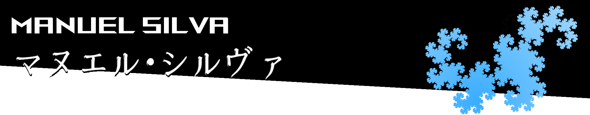</picture>
    

      はじめまして、<b>マヌエル</b>です👋 
      ポルトガルの工科大学を卒業して、 
      ポーランドの「」に５年７ヶ月間勤めていました。 
      東京ので留学生として勉強しています。  
      現在、<b>日本のゲーム会社の仕事を探しています。</b>
    

    

        <a href="https://linkedin.com/in/manuel-silva-4b225a71">[link]</a> で気軽にメッセージを送ってくれてください。
    

    <h2>💻 
      <picture></picture> 
      <picture></picture> 
      <picture></picture> 
      <picture></picture> 
    </h2>
    <h2>CD Projekt Redで取り組んだゲーム</h2>
    <picture>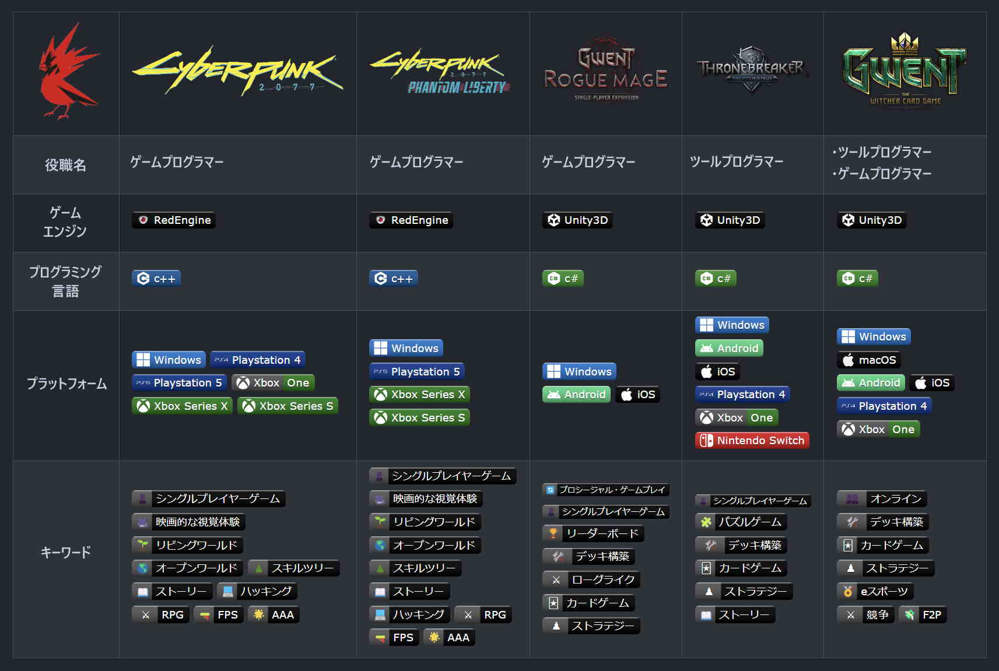</picture-->
    <!--table>
        <tr>
            <th><picture>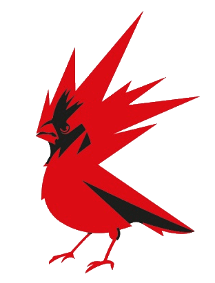</picture></td>
            <td><picture>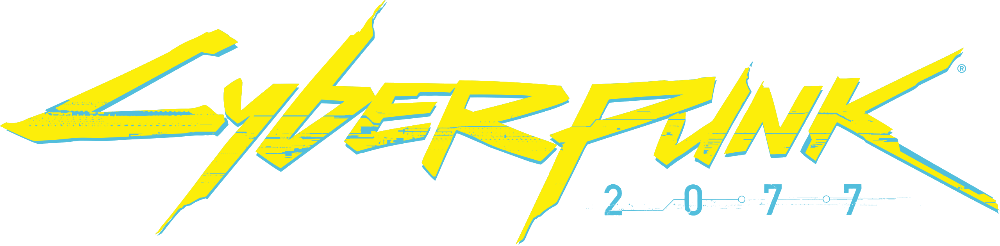</td>
            <td><picture>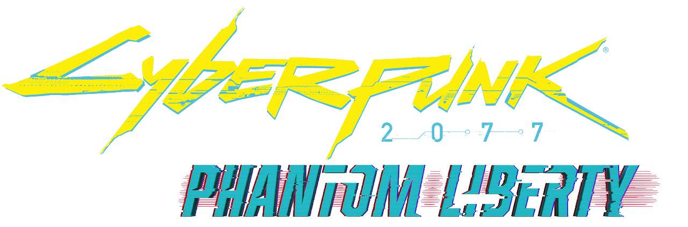</picture></td>
            <td><picture>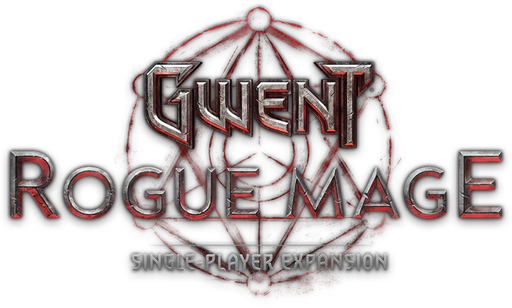</picture></td>
            <td><picture>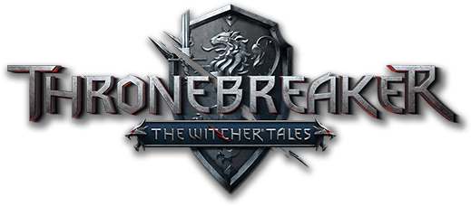</picture></td>
            <td><picture></picture></td>
        </tr>
        <tr>
            <th>Job Title</th>
            <td><b>ゲームプログラマー<b></td>
            <td><b>ゲームプログラマー</b></td>
            <td><b>ゲームプログラマー</b></td>
            <td><b>ツールプログラマー</b></td>
            <td><b>ツール/ゲームプログラマー</b></td>
        </tr>
        <tr>
            <th>Game Engine</th>
            <td></td>
            <td></td>
            <td><picture></picture></td>
            <td><picture></picture></td>
            <td><picture></picture></td>
        </tr>
        <tr>
            <th>Main Language</th>
            <td><picture></picture></td>
            <td><picture></picture></td>
            <td><picture></picture></td>
            <td><picture></picture></td>
            <td><picture></picture></td>
        </tr>
        <tr>
            <th>Platforms</th>
            <td>
                <picture></picture>
                <picture></picture>
                <picture></picture>
                <picture></picture>
                <picture></picture>
                <picture></picture>
            </td>
            <td>
                <picture></picture>
                <picture></picture>
                <picture></picture>
                <picture></picture>
            </td>
            <td>
                <picture></picture>
                <picture></picture>
                <picture></picture>
            </td>
            <td>
                <picture></picture>
                <picture></picture>
                <picture></picture>
                <picture></picture>
                <picture></picture>
                <picture></picture>
            </td>
            <td>
                <picture></picture>
                <picture></picture>
                <picture></picture>
                <picture></picture>
                <picture></picture>
                <picture></picture>
            </td>
        </tr>
        <tr>
            <th>Game Tags</th>
            <td>
                <picture></picture>
                <picture></picture>
                <picture></picture>
                <picture></picture>
                <picture></picture>
                <picture></picture>
                <picture></picture>
                <picture></picture>
                <picture></picture>
                <picture></picture>
            </td>
            <td>
                <picture></picture>
                <picture></picture>
                <picture></picture>
                <picture></picture>
                <picture></picture>
                <picture></picture>
                <picture></picture>
                <picture></picture>
                <picture></picture>
                <picture></picture>
            </td>
            <td>
                <picture></picture>
                <picture></picture>
                <picture></picture>
                <picture></picture>
                <picture></picture>
                <picture></picture>
            </td>
            <td>
                <picture></picture>
                <picture></picture>
                <picture></picture>
                <picture></picture>
                <picture></picture>
            </td>
            <td>
                <picture>;</picture>
                <picture></picture>
                <picture></picture>
                <picture></picture>
                <picture></picture>
                <picture></picture>
                <picture></picture>
                <picture></picture>
            </td>
        </tr>
    </table><!---->
    <h2><picture></picture> レビュー ▶️</h2>
    <table>
        <tr>
            <td><a href="https://www.youtube.com/watch?v=l46E7Q3UKqI">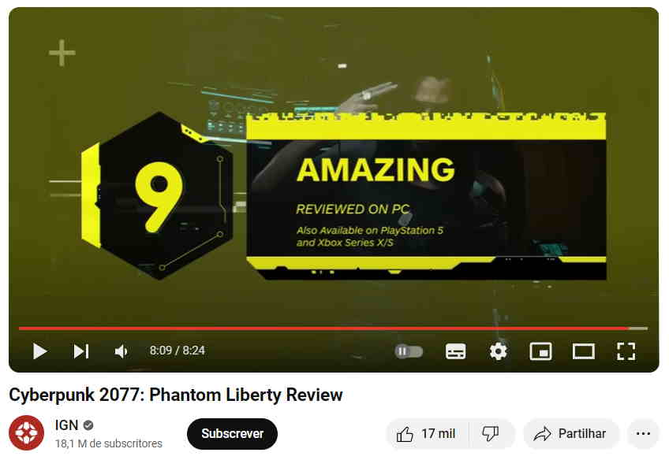</a></td>
            <td><a href="https://www.youtube.com/watch?v=ZXYn-Fn9w48">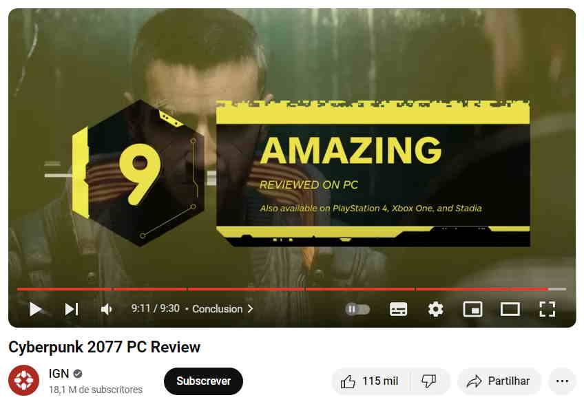</a></td>
        </tr>
        <tr>
            <td><a href="https://www.youtube.com/watch?v=4EynbB0MKmY">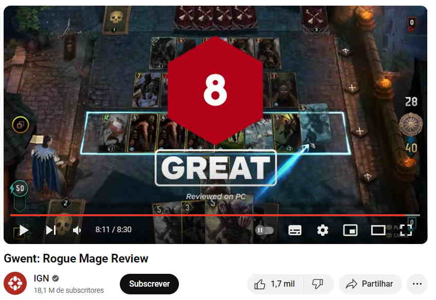</a></td>
            <td><a href="https://www.youtube.com/watch?v=wHYFitGGmmI">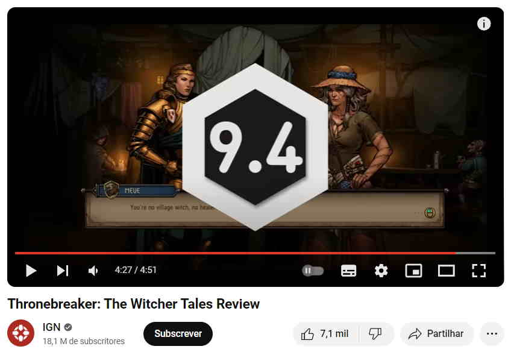</a></td>
        </tr>
    </table>
    <h2>🪄 私の趣味のもの</h2>
    <ul>
        <li>
            🎮 <a href="https://github.com/ManuelSilva/PlayDateBreakout">C 言語を使用して Playdate デバイス用のブレイクアウトっぽいゲーム</a>
             <tr>
      		<picture></picture>
			<picture></picture>
        </li>
        <li>
            🧠 <a href="https://github.com/ManuelSilva/FlattenedNDimensionalArrays">C++可変長引数テンプレートを使用してフラット化された多次元配列を作成する方法</a>
             <tr>
            <picture></picture>
        </li>
        <!--li>
            ☁️ C++とOpenGLで雲をレンダリング
            <tr>
           <picture></picture> 
           <picture></picture>
        </li-->
        <li>
            🕑 <a href="https://github.com/ManuelSilva/Cpp_SFML_Clock_Game">SFMLとC++を使用する時計ゲームとレイアウトシステム（未完成）</a>
             <tr>
			<picture></picture>
            <picture></picture>
        </li>
        <li>
            🐉 <a href="https://github.com/ManuelSilva/DragonCurveGenerator">ドラゴン曲線を生成するための小さなPythonスクリプト</a>
             <tr>
      		<picture></picture> 
        </li>
        <li>
            🧑‍🎨 <a href="https://github.com/ManuelSilva/ShadronPlayground">Shadronを使うGLSLの実験</a>
             <tr>
			<picture></picture>
			<picture></picture>
        </li>
    </ul>

</body>
