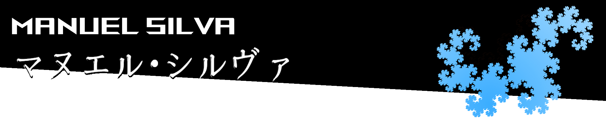
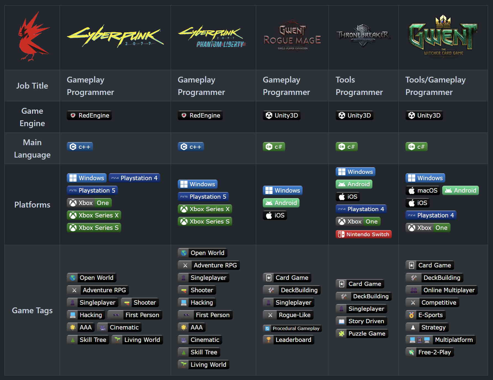
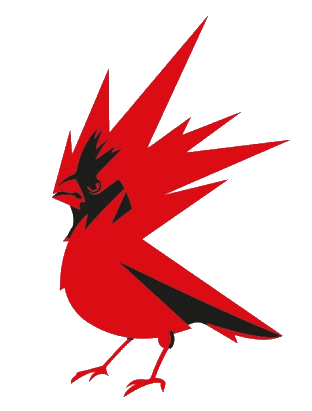
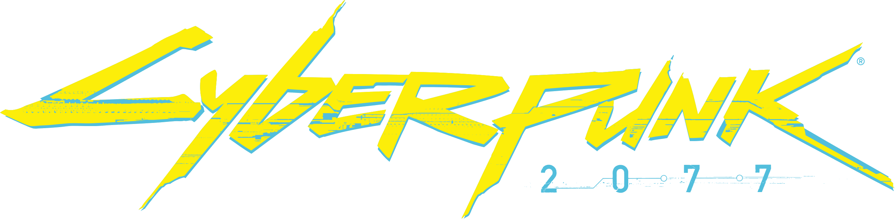
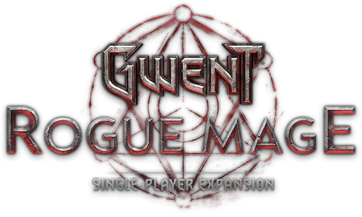
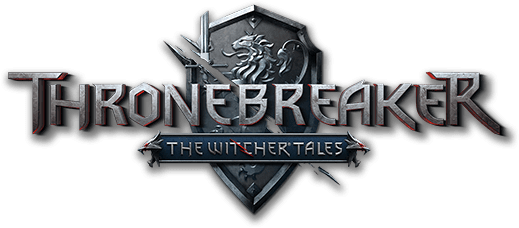
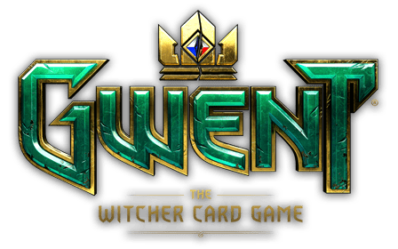
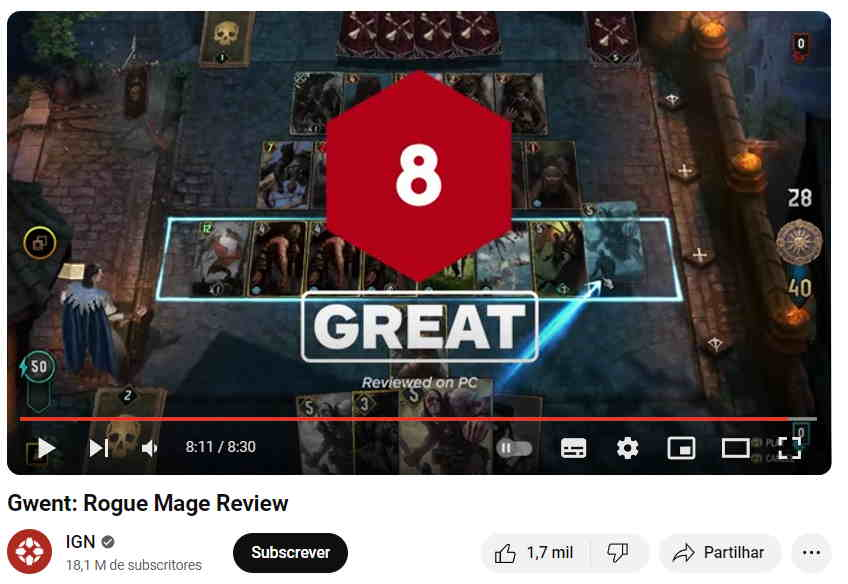

<body>
     
    
    
    <picture></picture>
     
    <picture></picture>
    

      Hello! My name is <b>Manuel</b>, welcome to my github page!👋 
      I graduated from  in Computer Engineering, 
      For 5 years and 7 months I worked at , 
      I'm currently in Tokyo studying Japanese at   
      <b>Looking for a job in a japanese game company!</b>
    

    

        Feel free to send me a message at <a href="https://linkedin.com/in/manuel-silva-4b225a71">[link]</a>
    

    <h2>💻 
      <picture></picture> 
      <picture></picture> 
      <picture></picture> 
      <picture></picture> 
    </h2>
    <h2>Games I worked on at CD Projekt Red</h2>
    <picture></picture-->
    <!--table>
        <tr>
            <th><picture></picture></td>
            <td><picture></td>
            <td><picture></picture></td>
            <td><picture></picture></td>
            <td><picture></picture></td>
            <td><picture></picture></td>
        </tr>
        <tr>
            <th>Job Title</th>
            <td><b>Gameplay Programmer<b></td>
            <td><b>Gameplay Programmer</b></td>
            <td><b>Gameplay Programmer</b></td>
            <td><b>Tools Programmer</b></td>
            <td><b>Tools/Gameplay Programmer</b></td>
        </tr>
        <tr>
            <th>Game Engine</th>
            <td></td>
            <td></td>
            <td><picture></picture></td>
            <td><picture></picture></td>
            <td><picture></picture></td>
        </tr>
        <tr>
            <th>Main Language</th>
            <td><picture></picture></td>
            <td><picture></picture></td>
            <td><picture></picture></td>
            <td><picture></picture></td>
            <td><picture></picture></td>
        </tr>
        <tr>
            <th>Platforms</th>
            <td>
                <picture></picture>
                <picture></picture>
                <picture></picture>
                <picture></picture>
                <picture></picture>
                <picture></picture>
            </td>
            <td>
                <picture></picture>
                <picture></picture>
                <picture></picture>
                <picture></picture>
            </td>
            <td>
                <picture></picture>
                <picture></picture>
                <picture></picture>
            </td>
            <td>
                <picture></picture>
                <picture></picture>
                <picture></picture>
                <picture></picture>
                <picture></picture>
                <picture></picture>
            </td>
            <td>
                <picture></picture>
                <picture></picture>
                <picture></picture>
                <picture></picture>
                <picture></picture>
                <picture></picture>
            </td>
        </tr>
        <tr>
        <th>Game Tags</th>
        <td>
            <picture></picture>
            <picture></picture>
            <picture></picture>
            <picture></picture>
            <picture></picture>
            <picture></picture>
            <picture></picture>
            <picture></picture>
            <picture></picture>
            <picture></picture>
        </td>
        <td>
            <picture></picture>
            <picture></picture>
            <picture></picture>
            <picture></picture>
            <picture></picture>
            <picture></picture>
            <picture></picture>
            <picture></picture>
            <picture></picture>
            <picture></picture>
        </td>
        <td>
            <picture></picture>
            <picture></picture>
            <picture></picture>
            <picture></picture>
            <picture></picture>
            <picture></picture>
            <picture></picture>
        </td>
        <td>
            <picture></picture>
            <picture></picture>
            <picture></picture>
            <picture></picture>
            <picture></picture>
            <picture></picture>
        </td>
        <td>
            <picture></picture>
            <picture></picture>
            <picture></picture>
            <picture></picture>
            <picture></picture>
            <picture></picture>
            <picture></picture>
        </td>
    </table><!---->
    <h2><picture></picture> Reviews ▶️</h2>
    <table>
        <tr>
            <td></td>
            <td></td>
        </tr>
        <tr>
            <td></td>
            <td></td>
        </tr>
    </table>
    <h2>🪄 Side Projects</h2>
    <ul>
        <li>
            🎮 <a href="https://github.com/ManuelSilva/PlayDateBreakout">Breakout Clone Game for the Playdate device using the C language</a>
             <tr>
      		<picture></picture>
			<picture></picture>
        </li>
        <li>
            🧠 <a href="https://github.com/ManuelSilva/FlattenedNDimensionalArrays">How to create flattened multidimensional arrays with algorithmic trickery and C++ Variadic Templates</a>
             <tr>
            <picture></picture>
        </li>
        <!--li>
            ☁️ Volumetric Cloud Rendering with C++ and OpenGL, optimizations with Intrinsics
            <tr>
           <picture></picture> 
           <picture></picture>
        </li-->
        <li>
            🕑 <a href="https://github.com/ManuelSilva/Cpp_SFML_Clock_Game">SFML C++ unfinished Clock game and Layout System</a>
             <tr>
			<picture></picture>
            <picture></picture>
        </li>
        <li>
            🐉 <a href="https://github.com/ManuelSilva/DragonCurveGenerator">small python script to generate dragon curves</a>
             <tr>
      		<picture></picture> 
        </li>
        <li>
            🧑‍🎨 <a href="https://github.com/ManuelSilva/ShadronPlayground">GLSL Experiments using Shadron</a>
             <tr>
			<picture></picture>
			<picture></picture>
        </li>
    </ul>

</body>
